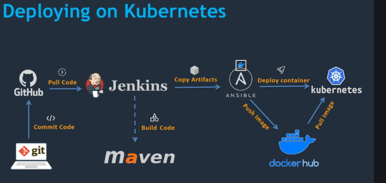

# What is it ?

  A ready to run dummy ci-cd processes using cloud provider AWS.
  Only Debian13 hosts. Other host operating systems may work, but are not currently tested.
  **Learning purposes.**

  Previously created and ran in 2024/2025 using Debian12. Should match with some correction (e.g Java).

  Provisioning with terraform. The terraform.tfstate is stored is AWS S3. The lock capability no more ask a dynamodb table. The news S3 has natively the "use_lockfile". You may find references to unused dynamodb in project files and docs.

  We create an AWS EKS Kubernetes cluster using eksctl.

  About Wazuh : it's just set for learning purposes and has nothing to deal with the project's main purposes.

# Architecture

     CI/CD PIPELINE

          USER
            |
      +-----------+-----------+
      |                       |
      GitHub Repository       Jenkins GUI
      |                       |
      Webhook Trigger          Nginx Proxy
      |                       |
      +-----> Jenkins <-------+
                 |
      +--------------------+--------------------+
      |                    |                    |
      v                    v                    v

      TOMCAT DEPLOY        DOCKER DEPLOY        KUBERNETES DEPLOY
      |                    |                    |
      Maven Build          Ansible                Ansible
      |                    |                    |
      WAR Artifact        Docker Build          k8s Host
      |                    |                    |
      SCP to Tomcat        DockerHub             eksctl
      |                    |                    |
      Restart Service        New Image          Update Deployment
      |                    |                    |
      Running App        Restart Container       New Pods

	Browser
	│
	│ HTTPS :443
	▼
	crook-ops-alb
	│
	├── /crook-ops/* ──────────→ Tomcat EC2 :8080
	│
	├── /docker/* ─────────────→ Docker EC2 :8080
	│
	└── /k8s/* ──HTTP──────────→ EKS NodePort
									│
									▼
								Kubernetes
									│
							┌──────┼──────┐
							▼      ▼      ▼
							Pod    Pod    Pod
							:8080  :8080  :8080

# Host requirements

The following software is required on the host:

| Software | Tested version |
|---|---|
| Ansible | 2.16.14 |
| gh | 2.78.0 |
| Git | 2.49.0 |
| Packer | v1.14.1 |
| Terraform | v1.16.3 |

The project is currently developed and tested on a RHEL Linux.

# Prerequisites

## AWS

Create your IAM user(s): one your choice, and a 'eks-user' (see: docs/IAM-Users.info if needed).

Default deployment will set a AmazonLoadBalancer. You can use it

### ACM certificate validation CNAME

Ask a certificate (if you wish to use AmazonLoadBalancer), update to fit your needs, here my subdomain is 'app'.

    TOKEN="cert_request_$(date +%s)"

    CERT_ARN=$(aws acm request-certificate \
      --domain-name "app.crook-ops.dev" \
      --validation-method "DNS" \
      --idempotency-token "$TOKEN" \
      --region eu-west-3 \
      --query "CertificateArn" \
      --output text)

    echo "New Certificate ARN: $CERT_ARN"
    New Certificate ARN: arn:aws:acm:eu-west-3:*********:certificate/2ee1a9f2-a89e-49e6-8fc6-16874rger83bf

    sleep 10

    CERT_ARN=$(aws acm list-certificates --region eu-west-3 --query "CertificateSummaryList[-1].CertificateArn" --output text)

Inspect certificate and add the CNAME record to your DNS registar

    aws acm describe-certificate \
      --certificate-arn "$CERT_ARN" \
      --region eu-west-3 \
      --query "Certificate.DomainValidationOptions[0].ResourceRecord"

        {
            "Name": "_5322cc3292de2777779fe137771decddd.app.crook-ops.dev.",
            "Type": "CNAME",
            "Value": "_1877318c186b9d6fez6f848z4efza385d0fd1.wzczefzefzk.acm-validations.aws."
        }

For example, on namecheap i have to set:

    record: CNAME
    host: _5322cc3292de2777779fe137771decddd.app
    value: _1877318c186b9d6fez6f848z4efza385d0fd1.wzczefzefzk.acm-validations.aws.

Wait for certificate to be validated

    aws acm describe-certificate \
      --certificate-arn "$CERT_ARN" \
      --region eu-west-3 \
      --query "Certificate.DomainValidationOptions[0].ValidationStatus" \
      --output text)

### Application DNS record (adapted to match the ACM certificate request)

    $ aws elbv2 describe-load-balancers \
    --region eu-west-3 \
    --query 'LoadBalancers[*].[LoadBalancerName,DNSName,Type,State.Code]' \
    --output table

      ---------------------------------------------------------------------------------------------------
      |                                      DescribeLoadBalancers                                      |
      +---------------+-------------------------------------------------------+--------------+----------+
      |  crook-ops-alb|  crook-ops-alb-56499990.eu-west-3.elb.amazonaws.com  |  application |  active  |
      +---------------+-------------------------------------------------------+--------------+----------+

For example, on namecheap i have to set:

    record: CNAME
    host: app
    value: crook-ops-alb-589774410.eu-west-3.elb.amazonaws.com.

## GITHUB

Create PAT on GitHub

## DOCKERHUB

Create 2 PAT (1 read/write/delete and 1 read) on DockerHub

## On your local machine

Clone the repo

		git clone https://github.com/memphis-tools/dummy_devops_on_aws.git

		cd dummy_devops_on_aws

Create secrets for ansible host: AWS_ACCESS_KEY_ID: '????' and AWS_SECRET_ACCESS_KEY: '????'

		ansible-vault create ansible/secrets/eks-user.creds

Create secrets for ansible host: GITHUB_TOKEN: '????'

		ansible-vault create ansible/secrets/gh.token

Create secrets for ansible host: KEYSTORE_PASSWORD: '????'

		ansible-vault create ansible/secrets/keystores_passphrase

Create secrets for ansible host: JENKINS_HTTPS_KEYSTORE: '????' and JENKINS_HTTPS_KEYSTORE_PASSWORD: '????'

		ansible-vault create ansible/secrets/jenkins

Create the **./ansible/.ansible.secret** used by ansible to open vault (must match your .env variables)

    pine@pplepie94

Create the **./ansible/.keystores-passphrase** used by ansible to setup keystores access (must match your .env variables)

    Lem@nadd17

Touch a .env file with something like this :

    # AWS
    export USER_PRIVATEKEY_PATH='~/.ssh/*****id_ed25519'

		# Packer (you must update)
		export AMI_OWNER_ID='*****'
		export AMI_SSH_KEY_PAIR_NAME='****'
		export AMI_BUILD_NAME='devops-machine'
		export AMI_SSH_USERNAME='admin'
		export AMI_PREFIX='devops-machine-linux'
		export AMI_INSTANCE_TYPE='t2.small'
		export AMI_OWNER_TYPE='****'
		export AMI_SOFTWARE_NAME='debian'
		export AMI_SOFTWARE_FULL_NAME='debian-13-amd64-*'
		export AWS_REGION='eu-west-3'

		# Terraform (you must update)
		# Variables not set in terraform/terraform.tfvars, because used in my dummy scripts and some by packer
		export TF_VAR_authorized_ip='****'
		export TF_VAR_aws_account_id=****
		export TF_VAR_aws_region='eu-west-3'
		# The name of the ssh keypair set on AWS console
		# This is the ssh keypair used by Terraform to interact (connect to, and setup ec2 instances), no passphrase here.
		export TF_VAR_aws_keypair_name='****'
		export TF_VAR_private_key_path="/home/$USERNAME/.ssh/****"
		export TF_VAR_ssh_pubkey_path="/home/$USERNAME/.ssh/****.pub"

		# Dockerhub (you must update)
		export DOCKERHUB_USERNAME='**'
		export DOCKERHUB_REPO_NAMESPACE='devops'
		export DOCKERHUB_ANSIBLE_RWD_PAT='dckr_pat_***'
		export DOCKERHUB_DOCKER_READONLY_PAT='dckr_pat_***'

		# Github (you must update)
		export GITHUB_USERNAME='**'
		export GITHUB_REPO_NAME='crook-ops'
		export GITHUB_TOKEN='ghp_***'

    # Some more dummy variables. Currently some ansible tasks use hardcode values whereas ENV should be used (e.g the jenkins setup).

		# Ansible
		export ANSIBLE_SSH_KEY_FILENAME='ansible_docker'
		export ANSIBLE_SSH_PASSPHRASE='x@pplepie94'
		export ANSIBLE_VAULT_SECRET='pine@pplepie94'

		# AWS secrets
		export ANSIBLE_AWS_SECRET_ID_NAME='ansible/2025/secrets'
		export DOCKER_AWS_SECRET_ID_NAME='docker/2025/secrets'
		export JENKINS_AWS_SECRET_ID_NAME='jenkins/2025/secrets'
		export NGINX_AWS_SECRET_ID_NAME='nginx/2025/private_key'
		export NGINX_PROXY_CLIENT_AWS_SECRET_ID_NAME='nginx/2025/proxy_client_private_key'
		export TOMCAT_AWS_SECRET_ID_NAME='tomcat/2025/secrets'

		# Commonly used
		export GRUB_PASSWORD='Lem@npie94'
		export P12_PASSPHRASE='che@sepie94'

		# Jenkins
		export JENKINS_ADMIN_USER_USERNAME='jenkins-admin'
		export JENKINS_ADMIN_USER_PASSWORD='x@pplepie94'
		export JENKINS_SSH_USER_USERNAME='jenkins'
		export JENKINS_SSH_USER_HOSTNAME='sanjurolab'
		export JENKINS_SSH_KEY_FILENAME='jenkins_github'
		export JENKINS_SSH_PASSPHRASE='x@pplepie94'
		export JENKINS_CREDENTIALS_ID='jenkins_github'
		# this JENKINS_HTTPS_KEYSTORE_PASSWORD comes with jenkins (so same syntax is (re)used)
		export JENKINS_HTTPS_KEYSTORE_PASSWORD='Lem@nadd17'

		# Tomcat
		export TOMCAT_DEPLOYER_CREDENTIAL_ID='jenkins_tomcat_deployer'
		export TOMCAT_HTTPS_KEYSTORE_PASSWORD='Lem@nadd17'
		export TOMCAT_DEPLOYER_USERNAME='deployer'
		export TOMCAT_DEPLOYER_PASSWORD='deployer'

		# Tomcat docker container
		export DOCKER_TOMCAT_KEYSTORE_PASSPHRASE='Lem@nadd17'

		# Misc
		export SELF_SIGNED_CA_NAME='aws-dummy-ops-ca.lab - DUMMY_OPS_TEAM'
		export CERT_PREFIX='aws_dummy_ops'
		export SELF_SIGNED_CA_PRIVATE_KEY_PASSPHRASE='applepie94'
		# If you wish to import a .der in firefox (see: setup_your_trust_self_signed_ca.sh)
		export LOCAL_DEFAULT_FIREFOX_PROFILE="/home/$USERNAME/.mozilla/firefox/****"

Check any credentials created, involved, for example :

    curl -H "Authorization: Bearer ghp_*************************" \
         -H "Accept: application/vnd.github.v3+json" \
         https://api.github.com/user

    curl -s -H "Authorization: Bearer dckr_pat_*********************" https://hub.docker.com/v2/users/me/

Optional, update cnf conf files in : ./openssl_cnf

Update packer/variables.auto.pkrvars.hcl

    cat > packer/variables.auto.pkrvars.hcl <<EOF
    ami_build_name        = "$AMI_BUILD_NAME"
    ami_instance_type     = "$AMI_INSTANCE_TYPE"
    ami_owner_id          = ["$AMI_OWNER_ID"]
    ami_prefix            = "$AMI_PREFIX"
    ami_region            = "$AWS_REGION"
    ami_ssh_key_pair_name = "$AMI_SSH_KEY_PAIR_NAME"
    ami_ssh_username      = "$AMI_SSH_USERNAME"
    ami_software_name     = "$AMI_SOFTWARE_NAME"
    ssh_pubkey_path       = "$TF_VAR_ssh_pubkey_path"
    EOF

Deploy the stack

    ./01-preconfig_project_setup.sh

    ./02-create_golden_image.sh

    ./03-update_infra.sh

    ./04-postconfig_project_setup.sh

    ./05-postconfig_local_machine.sh

    cd ansible

    ansible-playbook main.yml --vault-password-file .ansible.secret -l tomcat,docker,jenkins,ansible,nginx,wazuh_indexer,wazuh_server,wazuh_dashboard

    # Depending on your needs

    ansible-playbook main.yml --vault-password-file .ansible.secret -l k8s,

    ansible-playbook main.yml --vault-password-file .ansible.secret -l k8s, -t setup_k8s_bootstrap_server

    ansible-playbook main.yml --vault-password-file .ansible.secret -l k8s, -t run_k8s_dummy_app

    ansible-playbook main.yml --vault-password-file .ansible.secret -l k8s, -t run_k8s_dummy_app_with_alb

    ansible-playbook main.yml --vault-password-file .ansible.secret -l k8s, -t destroy_k8s_bootstrap_server

    cd ..

# About Wazuh

Think about update this.

    ansible/roles/install_auditd/files/rules.tar.gz

    ansible/roles/setup_wazuh_server_config/files/wazuh-filebeat-0.4.tar.gz

# Useful Links:

## Ansible EKS cluster

https://docs.ansible.com/projects/ansible/latest/collections/community/aws/eks_cluster_module.html

## Ansible's usefull modules

https://docs.ansible.com/ansible/latest/collections/community/general/jenkins_job_module.html

https://docs.ansible.com/ansible/latest/collections/amazon/aws/secretsmanager_secret_lookup.

https://docs.ansible.com/ansible/latest/collections/community/docker/docker_image_module.html

https://docs.ansible.com/ansible/latest/collections/community/docker/docker_container_module.html

https://docs.ansible.com/ansible/latest/collections/community/docker/docker_container_info_module.html

https://docs.ansible.com/ansible/latest/collections/community/docker/docker_compose_v2_module.html

https://docs.ansible.com/ansible/latest/collections/ansible/builtin/copy_module.html

https://docs.ansible.com/ansible/latest/collections/ansible/builtin/template_module.html

https://docs.ansible.com/ansible/latest/collections/ansible/builtin/service_module.html

## AWS

https://docs.aws.amazon.com/guardduty/latest/ug/securityhub-integration.html

https://docs.aws.amazon.com/guardduty/latest/ug/guardduty_integrations.html

## Docker

https://docs.docker.com/engine/install/debian/

## Dockerhub tokens

https://docs.docker.com/reference/api/hub/latest/#tag/access-tokens

## GitHub

https://github.com/jenkinsci/configuration-as-code-plugin/blob/master/README.md

https://github.com/cli/cli/blob/trunk/docs/install_linux.md#debian

## Jenkins - API

https://community.jenkins.io/t/can-we-create-a-user-token-through-the-api/8319/4

https://docs.cloudbees.com/docs/cloudbees-ci-kb/latest/client-and-managed-controllers/how-to-generate-change-an-apitoken

https://docs.cloudbees.com/docs/cloudbees-ci-kb/latest/client-and-managed-controllers/how-to-revoke-apitoken-after-a-user-left

https://plugins.jenkins.io/aws-secrets-manager-credentials-provider/

## Jenkins Configuration as Code and more

https://www.jenkins.io/projects/jcasc/

https://www.jenkins.io/doc/book/installing/initial-settings/

https://www.jenkins.io/doc/book/system-administration/reverse-proxy-configuration-troubleshooting/

## Nginx

https://docs.nginx.com/nginx/admin-guide/security-controls/securing-http-traffic-upstream/

## Packer

https://developer.hashicorp.com/packer/docs/templates/hcl_templates/functions/contextual/env

## Terraform

https://developer.hashicorp.com/terraform

### About state locking:
https://developer.hashicorp.com/terraform/language/state/locking

### REL08-BP04 Deploy using immutable infrastructure :
https://docs.aws.amazon.com/wellarchitected/latest/framework/rel_tracking_change_management_immutable_infrastructure.html

https://developer.hashicorp.com/well-architected-framework/define-and-automate-processes/define/immutable-infrastructure/virtual-machines

## Wazuh

https://documentation.wazuh.com/current/installation-guide/wazuh-indexer/step-by-step.html

https://documentation.wazuh.com/current/installation-guide/wazuh-server/step-by-step.html

https://documentation.wazuh.com/current/installation-guide/wazuh-dashboard/step-by-step.html

https://documentation.wazuh.com/current/installation-guide/wazuh-agent/wazuh-agent-package-linux.html

https://documentation.wazuh.com/current/getting-started/architecture.html

https://documentation.wazuh.com/current/user-manual/user-administration/password-management.html

## Wazuh alt installation, here with Ansible

https://documentation.wazuh.com/current/deployment-options/deploying-with-ansible/installation-guide.html

# Inspiration

This project is inspired by the Udemy course **DevOps CI/CD Project: Jenkins, Ansible and Kubernetes** by AR Shankar (Valaxy Technologies), which demonstrates manually a complete CI/CD workflow using Git, Jenkins, Maven, Docker, Ansible and Kubernetes on AWS EKS.

https://www.udemy.com/course/valaxy-devops/learn/lecture/29982498?start=0
